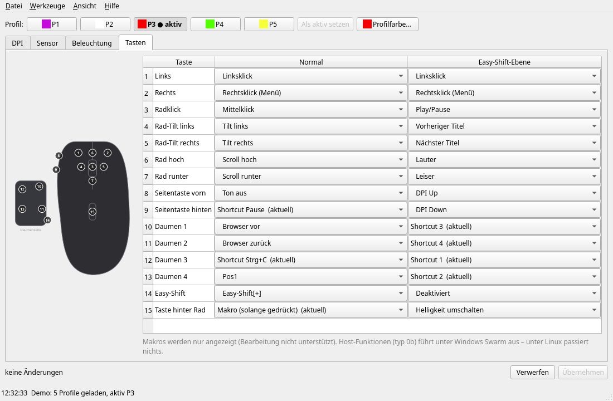

# konexp – ROCCAT Kone XP unter Linux konfigurieren

Kommandozeile und Qt-Oberfläche für die **ROCCAT Kone XP** (USB `1e7d:2c8b`), als Ersatz für
ROCCAT Swarm, das es nur für Windows gibt. Die Einstellungen werden direkt in den Speicher der Maus
geschrieben und gelten danach auch ohne laufende Software.



## Funktionen

- **Profile**: 5 Profile, aktives Profil wählen, Profilfarbe
- **DPI**: 5 Stufen (50–19000 in 50er-Schritten), Stufen an/aus, aktive Stufe
- **Sensor**: Polling-Rate (125–1000 Hz), Angle Snapping, Debounce (0–10 ms); Lift-off nur Anzeige
- **Beleuchtung**: Effekt (Fully Lit, Blinking, Breathing, Heartbeat, Photon FX, Colorwave),
  Geschwindigkeit, Helligkeit, Farbe je LED-Gruppe, LED-Timeout
- **Tasten**: 15 Tasten × 2 Ebenen (normal / Easy-Shift): Maus-, DPI-, Profil-, Multimedia- und
  Navigationsfunktionen, Tastatur-Shortcuts mit Modifiern, Easy-Aim
- **Sicherheit**: Änderungen werden gesammelt und vor dem Schreiben als Diff angezeigt; vor jedem
  Write wird gesichert, danach zurückgelesen und bei Abweichung automatisch wiederhergestellt
- Backup/Restore aller Profile, Zurücksetzen auf Werkseinstellungen, Demo-Modus ohne Maus

Noch nicht unterstützt: Makro-Editor (Makros werden angezeigt und bleiben erhalten), Lift-off-Kalibrierung,
AIMO (Software-Beleuchtung), Host-Funktionen wie „Programm öffnen“ (führt unter Windows Swarm aus).

## Installation

Voraussetzungen: Linux, Python ≥ 3.10, für die Oberfläche PySide6
(Arch: `pacman -S pyside6`, sonst `pip install PySide6`).

```sh
git clone <repo-url> konexp
cd konexp
```

Zugriff auf die Maus ohne root (einmalig):

```sh
sudo cp udev/70-kone-xp.rules /etc/udev/rules.d/
sudo udevadm control --reload
sudo udevadm trigger
```

Optional als Paket installieren (stellt `konexp` und `konexp-gui` bereit):

```sh
pip install --user '.[gui]'
```

## Benutzung

Oberfläche (im Repo-Verzeichnis):

```sh
python3 -m konexp.gui          # mit Maus
python3 -m konexp.gui --demo   # ohne Maus, schreibt nichts
```

Kommandozeile:

```sh
python3 -m konexp status                 # alle Profile anzeigen
python3 -m konexp profile 2              # Profil 3 aktivieren (Index 0–4)
python3 -m konexp dpi 2 4 3200           # Profil 3, Stufe 5 auf 3200 DPI
python3 -m konexp dpi-active 2 4         # Profil 3: Stufe 5 aktiv
python3 -m konexp restore <backup.bin>   # gesicherten Report zurückschreiben
```

Backups landen in `~/.local/share/konexp/backup/`.

## Sicherheit

`konexp` schreibt nur die Reports, die auch Swarm im Normalbetrieb schreibt. Firmware-Update,
Werksreset per Gerätebefehl (`0x09`) und von Swarm ungenutzte Reports sind gesperrt.
Getestet mit Firmware 1.09. Benutzung auf eigenes Risiko.

## Protokoll

Das Konfigurationsprotokoll ist in [docs/PROTOCOL.md](docs/PROTOCOL.md) beschrieben. Es wurde zur
Herstellung von Interoperabilität (§ 69e UrhG / Art. 6 RL 2009/24/EG) aus ROCCAT Swarm und Messungen an
der Maus ermittelt. Dieses Repository enthält keinen Code und keine Dateien des Herstellers.

## Tests

```sh
python3 -m pytest
```

Die Tests laufen ohne Maus (Demo-Backend mit Werksdaten).

## Lizenz

GPL-3.0-or-later, siehe [LICENSE](LICENSE).

ROCCAT, Kone, Swarm, AIMO und Easy-Shift sind Marken der jeweiligen Inhaber. Dieses Projekt steht in keiner
Verbindung zu ROCCAT oder Turtle Beach.
