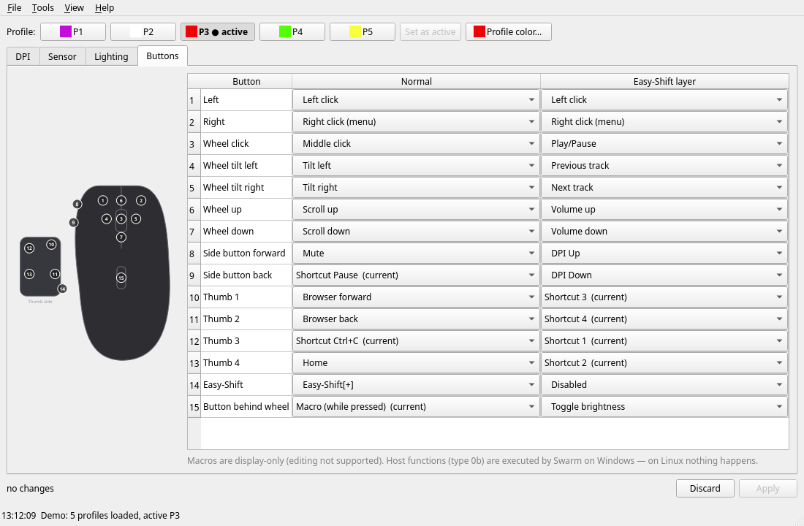

# konexp – configure the ROCCAT Kone XP on Linux

**English** | [Deutsch](README.de.md)

Command line tool and Qt GUI for the **ROCCAT Kone XP** (USB `1e7d:2c8b`), replacing the Windows-only
ROCCAT Swarm. Settings are written straight into the mouse's onboard memory and stay active without any
software running.



## Features

- **Profiles**: 5 profiles, select the active one, profile color
- **DPI**: 5 stages (50–19000 in steps of 50), enable/disable stages, active stage
- **Sensor**: polling rate (125–1000 Hz), angle snapping, debounce (0–10 ms); lift-off is read-only
- **Lighting**: effect (Fully Lit, Blinking, Breathing, Heartbeat, Photon FX, Colorwave), speed,
  brightness, color per LED group, LED timeout
- **Buttons**: 15 buttons × 2 layers (normal / Easy-Shift): mouse, DPI, profile, media and navigation
  functions, keyboard shortcuts with modifiers, Easy-Aim
- **Safety**: changes are collected and shown as a diff before writing; every write is backed up first,
  read back afterwards and restored automatically if the result differs
- Backup/restore of all profiles, reset to factory defaults, demo mode without a mouse

Not supported yet: macro editor (existing macros are shown and preserved), lift-off calibration,
AIMO (software-driven lighting), host functions such as "open program" (Swarm runs those on Windows).

The user interface is in English by default; German is available via `--lang de` (GUI), `KONEXP_LANG=de`
(GUI and CLI) or *View → Sprache / Language* (takes effect after a restart).
Translations live in `konexp/locale/*.po` (gettext); after changing texts run `python3 -m konexp.i18n extract`.

## Installation

Requirements: Linux, Python ≥ 3.10, PySide6 for the GUI
(Arch: `pacman -S pyside6`, otherwise `pip install PySide6`).

```sh
git clone https://github.com/cakebomb999/konexp.git
cd konexp
```

Allow access to the mouse without root (once):

```sh
sudo cp udev/70-kone-xp.rules /etc/udev/rules.d/
sudo udevadm control --reload
sudo udevadm trigger
```

Optionally install as a package (provides `konexp` and `konexp-gui`):

```sh
pip install --user '.[gui]'
```

## Usage

GUI (from the repository directory):

```sh
python3 -m konexp.gui          # with the mouse
python3 -m konexp.gui --demo   # without a mouse, writes nothing
```

Command line:

```sh
python3 -m konexp status                 # show all profiles
python3 -m konexp profile 2              # activate profile 3 (index 0–4)
python3 -m konexp dpi 2 4 3200           # profile 3, stage 5 to 3200 DPI
python3 -m konexp dpi-active 2 4         # profile 3: make stage 5 active
python3 -m konexp restore <backup.bin>   # write a saved report back
```

Backups are stored in `~/.local/share/konexp/backup/`.

## Safety

`konexp` only writes the reports that Swarm writes during normal use. Firmware updates, the device
factory-reset command (`0x09`) and reports Swarm never uses are blocked.
Tested with firmware 1.09. Use at your own risk.

## Protocol

The configuration protocol is documented in [docs/PROTOCOL.md](docs/PROTOCOL.md) (German). It was
determined for the purpose of interoperability (Art. 6 Directive 2009/24/EC, § 69e UrhG) by analysing
ROCCAT Swarm and measuring a real mouse. This repository contains no code or files from the manufacturer.

## Tests

```sh
python3 -m pytest
```

The tests run without a mouse (demo backend with factory data).

## License

GPL-3.0-or-later, see [LICENSE](LICENSE).

ROCCAT, Kone, Swarm, AIMO and Easy-Shift are trademarks of their respective owners. This project is not
affiliated with ROCCAT or Turtle Beach.
